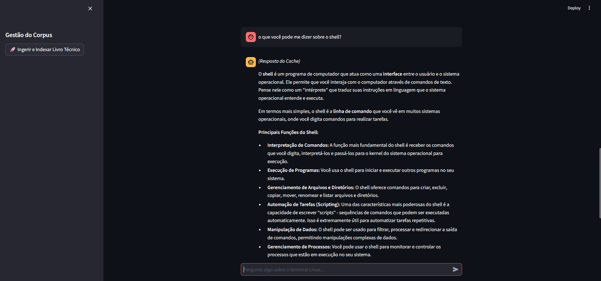

# 🐧 Assistente Técnico CLI: The Linux Command Line

🚀 **Acesse a aplicação online:** [linuxtechnicalassistant.streamlit.app](https://linuxtechnicalassistant.streamlit.app/)



Este repositório contém a entrega final do desafio de orquestração de LLMs e Tool-use desenvolvido para a **Residência em TIC 44 (CTE-IA)** (SiDi / SOFTEX Campinas).

O projeto é um assistente de IA focado no ecossistema Linux, capaz de responder perguntas complexas consultando a documentação oficial do livro *"The Linux Command Line"*, acionar ferramentas determinísticas e otimizar custos operacionais.

## 🏗️ Arquitetura e Decisões Técnicas

A aplicação foi construída com foco em **Clean Architecture** e modularidade, separando claramente a camada de interface (Streamlit) da lógica de negócios e pipelines de dados (Backend em Python). 

Os três pilares técnicos principais são:

1. **RAG (Retrieval-Augmented Generation) com ChromaDB:** Indexação de corpus textual complexo com fatiamento (chunking) semântico. Utilizamos o modelo `gemini-2.5-flash-lite` para geração e embeddings nativos para busca vetorial silenciosa e eficiente.
2. **Orquestrador de Tool-Use:** Implementação de roteamento inteligente onde o LLM decide autonomamente entre buscar no banco vetorial (RAG) ou invocar uma função estática (`lookup_chapter`) com base na intenção do usuário.
3. **Cache Semântico em Memória:** Sistema de cache customizado que intercepta perguntas idênticas e devolve a resposta instantaneamente, evitando chamadas desnecessárias à API e reduzindo custos operacionais.

## 🚀 Funcionalidades da Interface
- **Streaming de Respostas:** Efeito máquina de escrever nativo usando *generators* para reduzir a percepção de latência.
- **Rastreabilidade:** Citações exatas do arquivo e da página de origem anexadas a cada resposta do RAG.
- **Visualização de Estado:** Feedback claro na UI quando uma resposta é recuperada do Cache em vez da API.

## 📊 Avaliação Automatizada (RAGAS)
A pipeline de avaliação foi automatizada utilizando o framework RAGAS para garantir a qualidade das respostas do assistente de forma objetiva, medindo métricas cruciais como:
- **Faithfulness (Fidelidade):** Garantia de ausência de alucinações (nota obtida: 0.75).
- **Context Precision:** Relevância dos chunks recuperados do banco vetorial.

*Os resultados detalhados das baterias de testes estão disponíveis no arquivo `ragas_results.csv` na raiz do projeto.*

## ⚙️ Como Executar Localmente

**Pré-requisitos:** Python 3.12+

1. Clone o repositório:
```bash
git clone [https://github.com/](https://github.com/)[seu-usuario]/[nome-do-repo].git
cd [nome-do-repo]

```

2. Crie e ative um ambiente virtual:

```bash
py -3.12 -m venv .venv
# No Windows:
.\.venv\Scripts\activate
# No Linux (Ubuntu):
source .venv/bin/activate

```

3. Instale as dependências do projeto:

```bash
pip install -e .

```

4. Configure a chave da API:
Crie um arquivo `.env` na raiz do projeto contendo:

```env
GEMINI_API_KEY=sua_chave_aqui

```

5. Execute a aplicação:

```bash
streamlit run src/ui/streamlit_app.py

```

## 👥 Autores

* **Paulo Jânio dos Santos Júnior** - [https://www.linkedin.com/in/paulo-j%C3%A2nio-163b97308/]
* **Pedro Henrique Câmara Matos** - [https://www.linkedin.com/in/pedrocamaramatos/]